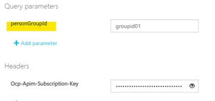

 
Face API 顔認識機能を、プログラミングせずに利用する方法をご紹介します。
- [利用にあたり推奨するサンプル画像](#利用にあたり推奨するサンプル画像について)
- [手順概要](#手順概要)
- [手順詳細](#手順詳細)
<!-- more -->
- [(準備)キーとエンドポイントを確認](#(準備)キーとエンドポイントを確認) 
- [Ⅰ-1.グループを登録する](#Ⅰ-1.グループを登録する)
- [Ⅰ-2.グループに対して、人物を登録する](#Ⅰ-2.グループに対して、人物を登録する)
- [Ⅰ-3.学習用画像の準備 ](#Ⅰ-3.学習用画像の準備 )
- [Ⅰ-4.人物に対して、学習用画像を登録する](#Ⅰ-4.人物に対して、学習用画像を登録する)
- [Ⅰ-5.モデルの学習](#Ⅰ-5.モデルの学習)
- [Ⅰ-6.学習結果の確認](#Ⅰ-6.学習結果の確認)
- [Ⅱ-1.顔認識用画像の準備](#Ⅱ-1.顔認識用画像の準備)
- [Ⅱ-2.顔認識の実行](#Ⅱ-2.顔認識の実行)
 

***

# 利用にあたり推奨するサンプル画像について
利用にあたっては、[チュートリアル](https://github.com/MicrosoftDocs/ai-fundamentals/blob/master/01d%20-%20Face%20Analysis.ipynb)で利用されているサンプル画像の利用を推奨します。 
顔認識には[一定以上の品質の画像](https://docs.microsoft.com/ja-jp/azure/cognitive-services/face/concepts/face-recognition#input-data)が必要となるため、まずは以下のサンプル画像でお試しをいただければスムーズに確認が進みます。

#### ai-fundamentals/data/face/wendell　（学習する人物画像として利用）
- https://raw.githubusercontent.com/MicrosoftDocs/ai-fundamentals/master/data/face/wendell/Wendell_01.jpg
- https://raw.githubusercontent.com/MicrosoftDocs/ai-fundamentals/master/data/face/wendell/Wendell_02.jpg
- https://raw.githubusercontent.com/MicrosoftDocs/ai-fundamentals/master/data/face/wendell/Wendell_03.jpg 
  

#### ai-fundamentals/data/face/employees.jpg　（顔認識対象の画像として利用）
- https://raw.githubusercontent.com/MicrosoftDocs/ai-fundamentals/master/data/face/employees.jpg
 

 

***
# 手順概要
手順の概要は、以下の表のとおりです。  
Ⅰ-1 から、Ⅱ-2に至るまで、順に、[API] 列のリンクをクリックして開く リファレンスAPIページ（一部について製品デモページ）での処理実行をお試しください。 
なお、「Ⅰ-4 学習用画像の登録」（および「Ⅰ-3 学習用画像の準備」）については一括登録が行えないため、学習画像の枚数分、複数回の実行が必要です。 
 
### Ⅰ.モデルの学習を行う

|  手順内容  |  API  |  主要な送信パラメータ |  主要な受信パラメータ  |  備考  |
| ---- | ---- | ---- | ---- | ---- |
|  1.グループを登録する  |  [PersonGroup - Create](https://japaneast.dev.cognitive.microsoft.com/docs/services/563879b61984550e40cbbe8d/operations/563879b61984550f30395244)  |  グループID, グループ名 |  -  |  グループIDはユーザーが任意に設定する  |
|  2.グループに対して、人物を登録する  |  [PersonGroup Person – Create](https://japaneast.dev.cognitive.microsoft.com/docs/services/563879b61984550e40cbbe8d/operations/563879b61984550f3039523c)  |  グループID, 人物名  |  人物ID  |  人物IDは自動で設定される  |
|  3.学習用画像の準備   |  [Face - Detect](https://azure.microsoft.com/ja-jp/services/cognitive-services/face/#demo)  |  人物画像のURL  |  顔ID, 画像のURLから顔として認識された領域の座標情報  |  検出した顔座標が画像上に可視化される利便があるため、デモ画面の利用を推奨  |
|  4.人物に対して、学習用画像を登録する  |  [PersonGroup Person - Add Face](https://japaneast.dev.cognitive.microsoft.com/docs/services/563879b61984550e40cbbe8d/operations/563879b61984550f3039523b)  |  グループID, 人物ID, 人物画像のURL, 人物画像の中の顔領域の座標情報  |  -  |  学習用画像の登録は画像1枚ずつの登録。REST APIでは一括登録不可  |
|  5.モデルの学習  |  [PersonGroup - Train](https://japaneast.dev.cognitive.microsoft.com/docs/services/563879b61984550e40cbbe8d/operations/563879b61984550f30395249)  |  グループID  |  -  |  -  |
|  6.学習結果の確認  |  [PersonGroup - Get Training Status](https://japaneast.dev.cognitive.microsoft.com/docs/services/563879b61984550e40cbbe8d/operations/563879b61984550f30395247)  | グループID  |  学習結果状況  |  -  |

　
### Ⅱ.顔認識を行う

|  手順内容  |  API  |  主要な送信パラメータ |  主要な受信パラメータ  |  備考  |
| ---- | ---- | ---- | ---- | ---- |
|  1.顔認識用画像の準備  |  [Face - Detect](https://japaneast.dev.cognitive.microsoft.com/docs/services/563879b61984550e40cbbe8d/operations/563879b61984550f30395236)  |  人物画像のURL  |  顔ID, 画像のURLから顔として認識された領域の座標情報  |  自分のキー配下で発行される顔IDを取得するために、リファレンスAPIページを利用  （任意）デモ画面で検出した顔座標状況を確認  |
|  2.顔認識の実行  |  [Face - Identify](https://japaneast.dev.cognitive.microsoft.com/docs/services/563879b61984550e40cbbe8d/operations/563879b61984550f30395239)  |  グループID, 顔ID  |  (顔IDごとに) 人物ID, 確度  |  -  |

***
# 手順詳細
以下にご参考まで、2020年10月時点の各手順実行時のスクリーンショットを貼付します。

***
# (準備)キーとエンドポイントを確認
Azure ポータル画面のFaceリソース画面で、キーとエンドポイントを確認します。キーは後続の処理で利用するので、その文字列を取り置きます。 
 

***
# Ⅰ-1.グループを登録する
(1) [リファレンスAPI](https://japaneast.dev.cognitive.microsoft.com/docs/services/563879b61984550e40cbbe8d/operations/563879b61984550f30395244)ページにアクセスすると、ページの中ほどにエンドポイントを選択するセクションがあります。
前の手順で確認したエンドポイントが記載された青いボックスをクリックして、テスト用ページへ遷移します。 
  

(2) テスト用ページの中ほどに、パラメータを設定するセクションがあります。 
Ocp-Apim-Subscription-Key　には、前の手順で確認したキー情報を設定します。 
その他項目は、以下の画像のように設定します。 グループID (personGroupId) もグループ名称 (name) も、ユーザーで任意に設定可能です。
また、Request body に設定する userData はオプション項目のため、削除せずに付加したままでも構いません。 
パラメータを設定し終わったら、[Send] ボタンをクリックします。 

(3) レスポンスセクションに結果が表示されます。 以下の画像のように [200 OK] と応答があれば問題ありません。処理が成功しています。 

***
# Ⅰ-2.グループに対して、人物を登録する
（以降、前の手順と重複するエンドポイント選択手順などは割愛します。 
　ご参考として、リクエストセクションと、レスポンスセクションのスクリーンショットをそれぞれ貼付します） 
 
[PersonGroup Person – Create](https://japaneast.dev.cognitive.microsoft.com/docs/services/563879b61984550e40cbbe8d/operations/563879b61984550f3039523c) ページを開きます。  
(1) リクエストセクション 
前の手順で設定したグループIDを入力します。 
人物名は、ユーザー様で任意に設定可能です（この名称は以降の手順では特に利用しません） 

(2) レスポンスセクション 
以降の手順で必要となるため、自動で設定された personId を取り置きます。 

***
# Ⅰ-3.学習用画像の準備
[デモ画面](https://azure.microsoft.com/ja-jp/services/cognitive-services/face/#demo)を開き、[Face Detection] デモが選択されていることを確認します。 
以下の画像のように、画面左下の [画像のURL] 入力項目にURLを入力して [送信]　ボタンをクリックします。 

画面右側に、顔として認識された領域の座標情報が出力されます。 
同時に画面左側に、その領域が元の顔画像に青いバウンディングボックスとして可視化されるので、どこが顔として認識されたのかが容易に確認可能です。

次の手順のために、画面右側に出力された座標情報を取り置きます。

***
# Ⅰ-4.人物に対して、学習用画像を登録する

[PersonGroup Person - Add Face](https://japaneast.dev.cognitive.microsoft.com/docs/services/563879b61984550e40cbbe8d/operations/563879b61984550f3039523b) ページを開きます。 

(1) リクエストセクション 
これまでの手順で設定および取得した、グループIDと人物IDを入力します。 
また、targetFace には、前の手順で取得した顔として認識された領域の座標情報を入力します。以下のようなフォーマット変換が必要です。 

| フォーマット変換前 |フォーマット（"targetFace=left,top,width,height"）変換後 |
|-----------|------------|
| "faceRectangle": {"top": 313,"left": 205,"width": 459,"height": 626}, | 205,313,459,626 |
 detectionModelは、現時点で最新の detection_02 バージョンを選択します。 
urlには、前の手順と同じ画像のURLを入力します。 

(2) レスポンスセクション 
[200 OK] と応答があれば問題ありません。また、ここで返却される persistedFaceId は以降の手順で利用しません。 

***
# Ⅰ-5.モデルの学習
[PersonGroup - Train](https://japaneast.dev.cognitive.microsoft.com/docs/services/563879b61984550e40cbbe8d/operations/563879b61984550f30395249) ページを開きます。  
(1) リクエストセクション 
グループIDを設定します。 

(2) レスポンスセクション 
[202 Accepted]の応答があれば問題ありません。次の手順で、学習の結果を確認します。 

***
# Ⅰ-6.学習結果の確認

[PersonGroup - Get Training Status](https://japaneast.dev.cognitive.microsoft.com/docs/services/563879b61984550e40cbbe8d/operations/563879b61984550f30395247) ページを開きます。  
(1) リクエストセクション 
グループIDを設定します。 

(2) レスポンスセクション 
"status": "succeeded" と返却されていれば問題ありません。 

***
# Ⅱ-1.顔認識用画像の準備

[Face - Detect](https://japaneast.dev.cognitive.microsoft.com/docs/services/563879b61984550e40cbbe8d/operations/563879b61984550f30395236) ページを開きます。  
(1) リクエストセクション 
recognitionModelで、現時点で最新の recognition_03 バージョンを選択します。 
detectionModelで、現時点で最新の detection_02 バージョンを選択します。 
urlに顔認識用画像のURLを入力します。
 

(2) レスポンスセクション 
次の手順のために、出力されたfaceIdを取り置きます。 

 
※ 任意手順 

[デモ画面](https://azure.microsoft.com/ja-jp/services/cognitive-services/face/#demo) で、以下のように顔認識用画像のURLを入力して [送信]　し、検出された顔座標の状況を目視確認します。 
サンプル画像に detection_02 モデルを適用すると、2つの顔が検出されます。 

***
# Ⅱ-2.顔認識の実行

[Face - Identify](https://japaneast.dev.cognitive.microsoft.com/docs/services/563879b61984550e40cbbe8d/operations/563879b61984550f30395239) ページを開きます。  
(1) リクエストセクション 
Request bodyに、以下のように設定します。 
largePersonGroupId **を削除し**、**personGroupId**　にキーを変更します。そして、グループIDを入力します。 
faceIds には、以下のように前の手順で取得した顔IDを入力します。 

>{
>    "**personGroupId**": "groupid01", 
>    "**faceIds**": [ 
>    "17d2e2a6-c891-4f16-bf6e-14180c9b0e8b", 
    "a3a2ce7c-3743-4819-ae8f-47d4940bbee5" 
>    ], 
>    "maxNumOfCandidatesReturned": 1, 
>    "confidenceThreshold": 0.5 
>}

maxNumOfCandidatesReturned などの項目は、既定のままでも、画面に表示されている説明に準じて、値を変更いただいても問題ありません。

(2) レスポンスセクション 
顔IDごとに、顔認識の結果として、その人物IDと確度（0から1の値をとります）が返却されます。 
人物IDが返却されない場合は、パラメータセクションで confidenceThreshold に設定した以上の値の確度で認識した人物に該当がなかったことを示します。
 
以下の画像が示す結果は、検出された2つの顔のうち、1つの顔には該当する登録済人物がおらず、もう1つの顔については 0.94 の確度で登録済の人物が該当するという内容になります。 

***
`変更履歴`  
`2020/10/19 created by Uehara`  